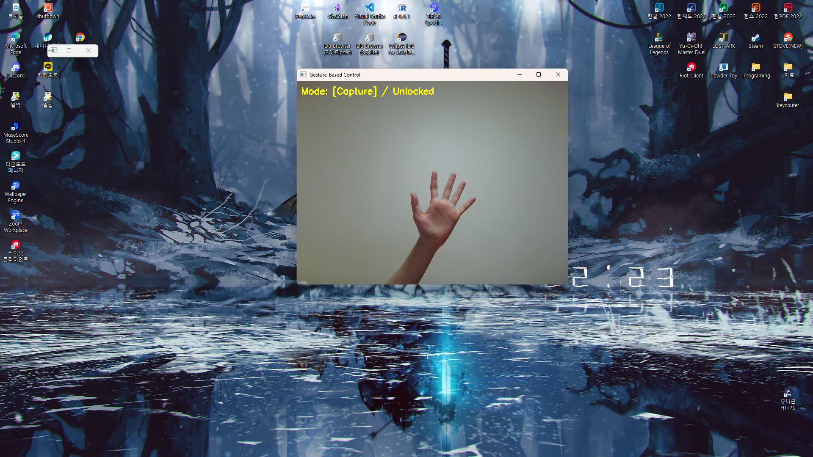

# ✋ Hand-Controlled PC Interaction

웹캠으로 손을 인식해, 다양한 기능을 제스처로 조작하는 프로그램입니다.  
노트북의 터치패드처럼 마우스 없이 PC를 제어하는 것을 목표로 만들었습니다.

---

## 📌 기능 요약

| 모드 키 | 기능명        | 설명                                                                 |
|--------|---------------|----------------------------------------------------------------------|
| `v`    | 볼륨 조절     | 검지손가락을 위/아래로 움직여 시스템 볼륨을 조절할 수 있습니다.          |
| `z`    | 줌 돋보기     | 검지 위치를 중심으로 화면을 확대해 보여주는 기능 |
| `s`    | 스크린 캡처   | 손바닥을 펼쳐 화면을 캡처하고 저장합니다.                              |

> ✅ 각 기능은 키보드로 모드를 전환하며 동작합니다.  
> ✅ 스페이스바 또는 엔터 키를 눌러 현재 동작을 "고정"하거나 "해제"할 수 있습니다.  
> ✅ 캡처된 이미지들은 `/captures/` 폴더에 자동 저장됩니다.  
> ⚠️ 돋보기 기능은 손가락과 실시간으로 연동되지 않습니다. 스페이스바 또는 엔터키를 눌러 돋보기를 토글할 수 있습니다.

---

## 🧠 주요 기술

- `OpenCV` : 웹캠 입력 처리 및 손 검출 시각화
- `mediapipe` : 손 랜드마크(관절 위치) 추적
- `ctypes` : 시스템 커서 조작, 윈도우 해상도 확인
- `mss` : 빠른 화면 캡처
- `pycaw` : 시스템 볼륨 제어

---

## 📁 파일 구조

```
project_root/
│
├── main.py                  # 메인 루프, 모드 전환 및 핸들링
├── _handTracking.py         # 손 인식 기능 모듈
├── _control_base.py         # 공통 기능(BaseControl 클래스)
├── __volumeControl.py       # 볼륨 조절 기능 모듈
├── __screenCapture.py       # 스크린 캡처 기능 모듈
├── __zoomControl.py         # 화면 확대 기능 모듈
├── /captures/               # 캡처 이미지 저장 폴더
└── README.md
```

---

## ⚙️ 사용법

1. Python 3.8+ 환경에서 다음 패키지를 설치하세요:

```bash
pip install -r requirements.txt
```

2. 실행:

```bash
python main.py
```

3. 실행 후 웹캠을 통해 손을 인식하며, `v`, `s` 등의 키를 눌러 모드를 전환하세요.

---

## ❗ 주의 사항

- **Windows 환경에서만** 정상 동작합니다. (`ctypes`, `mss` 사용)
- 카메라 품질이 낮거나 손이 잘 안 보이면 인식이 어려울 수 있습니다.
- 시스템 커서 및 볼륨 조작은 관리자 권한 없이 가능합니다.

---

## 🙏 Special Thanks

이 프로젝트는 손 제스처를 활용한 PC 조작 실험으로,  
**OpenAI의 ChatGPT의 협력**을 통해 함께 만들어졌습니다.  
더 발전시키고 싶은 분은 자유롭게 포크하고 확장해 주세요!

---

## 🖼️ 데모

### 🔊 볼륨 조절

검지 손가락을 위/아래로 움직여 시스템 볼륨을 직관적으로 조절할 수 있습니다.  
스페이스바 또는 엔터 키로 원하는 위치에서 볼륨을 고정할 수 있습니다.  


화면에 손을 2개 인식시키면 음소거 됩니다.  


---

### ✋ 화면 캡처

손바닥을 펼치는 제스처를 통해 손쉽게 현재 화면을 캡처하고, 자동으로 저장됩니다.  



---

### 🔍 화면 확대 (줌)

검지 위치를 기준으로 컴퓨터 화면의 일부분을 확대해 볼 수 있는 기능입니다.  
실시간 처리 성능 문제로 현재는 일부 기능만 사용할 수 있는 상태입니다.  
스페이스바를 눌러 확대(위치 고정) ↔ 커서이동(확대 위치 조정) 상태로 토글할 수 있습니다.  

